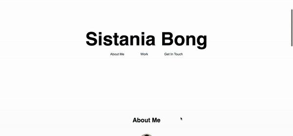

# professional-portfolio

## Description
This repo consists of my professional portfolio page.

## User Story
```
AS AN employer
I WANT to view a potential employee's deployed portfolio of work samples
SO THAT I can review samples of their work and assess whether they're a good candidate for an open position
```

## Acceptance Criteria
```
GIVEN I need to sample a potential employee's previous work
WHEN I load their portfolio
THEN I am presented with the developer's name, a recent photo or avatar, and links to sections about them, their work, and how to contact them
WHEN I click one of the links in the navigation
THEN the UI scrolls to the corresponding section
WHEN I click on the link to the section about their work
THEN the UI scrolls to a section with titled images of the developer's applications
WHEN I am presented with the developer's first application
THEN that application's image should be larger in size than the others
WHEN I click on the images of the applications
THEN I am taken to that deployed application
WHEN I resize the page or view the site on various screens and devices
THEN I am presented with a responsive layout that adapts to my viewport
```

## Features
This portfolio webpage includes:
- Header with my name
- Navigation bar that links to sections 'About Me', 'Work', and 'Contact'
- Sections of my work
- Footer at the bottom page that includes links to my LinkedIn, GitHub, and Website and Contact Me button that opens up to email

## Mock-Up
The following image displays the web application's appearance:



## Review
To review the refactored code, please go to the [repository](https://github.com/sistaniabong/professional-portfolio)

## Deploy
To deploy this web application, please click on this [link](https://sistaniabong.github.io/professional-portfolio/)